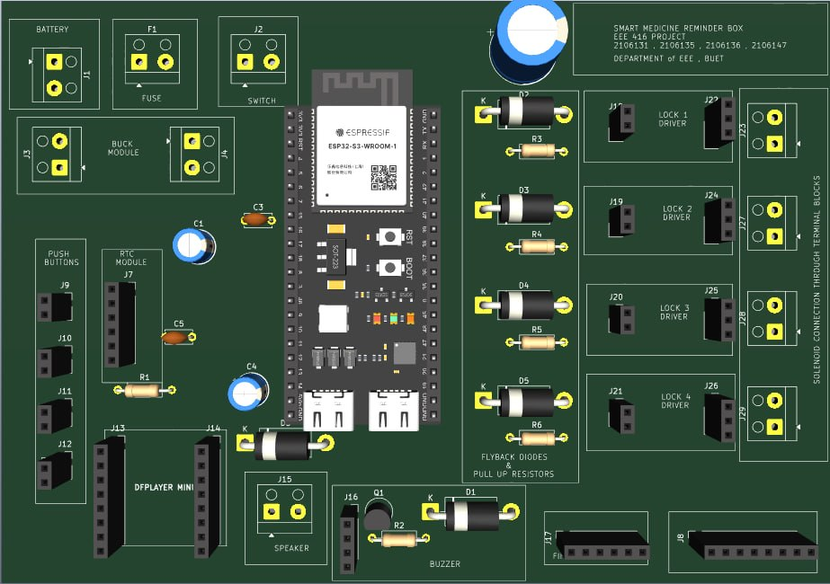
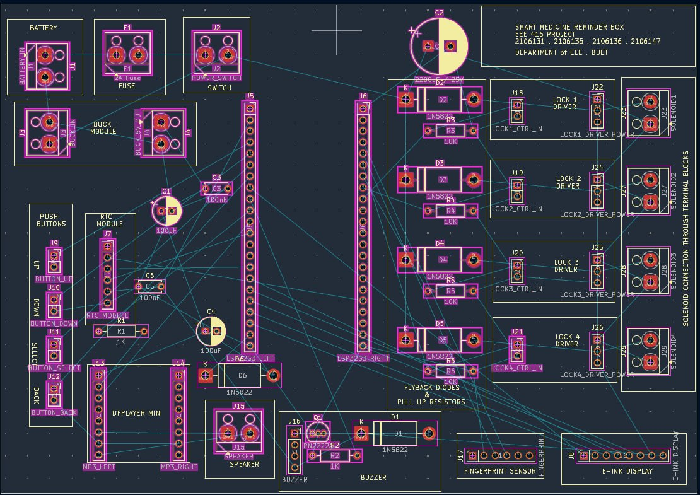

# Smart Medicine Reminder — ঔষধ যন্ত্র

A biometric medicine box for two elderly users, with a fully Bengali interface.

At the scheduled time it sounds a buzzer, speaks in Bangla and unlocks **only the
correct compartment**, and **only** for the fingerprint of the person that dose
belongs to. Every dose is recorded. Nothing in the user's path requires a phone,
an account, or an internet connection.

EEE 416 Project · Department of EEE, BUET

<p align="center">
  
</p>

---

## Why it is built this way

Most pill reminders beep and hope. The problem with an elderly household is not
being reminded — it is that the **wrong medicine gets taken**, or nobody can say
afterwards whether it was taken at all.

So three rules drive the whole design:

1. **Only the scheduled person, only during their dose window, opens that
   compartment.** An enrolled but wrong fingerprint opens nothing. A correct
   fingerprint outside a dose window opens nothing.
2. **Every dose ends in a recorded outcome** — taken, missed, or unconfirmed.
   Never silently.
3. **The device is useless if it needs the internet.** Reminders, fingerprint,
   locks, screen and log are entirely local. The network is optional everywhere.

Everything the user sees or hears is Bengali. Code identifiers stay English;
pixels and audio do not.

---

## What it does

| | |
|---|---|
| **Scheduling** | 4 compartments, independent times, per-dose medicine name and course length |
| **Authentication** | R307S fingerprint, 3 identities — two residents and a caretaker |
| **Locks** | 4 solenoids, 400 ms pulse, one at a time, software interlocked |
| **Display** | 1.54" e-paper, Bengali, partial refresh |
| **Voice** | 17 Bengali prompts over DFPlayer Mini |
| **Logging** | Append-only CSV on 9.8 MB of on-chip flash — about 34 years of doses |
| **Dashboard** | Bengali web UI served by the device's own Wi-Fi access point, no router needed |
| **Alerts** | Optional Telegram — missed doses as they happen, plus a daily summary |
| **Power** | Light sleep between doses, hardware RTC alarm wake |

### A dose, start to finish

```
buzzer ──▶ "দাদু, ঔষধ গ্রহণের সময় হয়েছে"  ──▶ আঙুলের ছাপ দিন
                                                      │
                     wrong finger ◀───────────────────┤
                   (nothing opens,                    │ correct finger
                    logged, voiced)                   ▼
                                            compartment unlocks
                                                      │
                            ┌─────────────────────────┴──────────────┐
                        SELECT pressed                      120 s, nothing
                            ▼                                        ▼
                      ঔষধ গ্রহণ সম্পন্ন                      ঔষধ গ্রহণ নিশ্চিত হয়নি
                          TAKEN                                 UNCONFIRMED
```

No fingerprint within 10 minutes → **MISSED**, logged and alerted.

---

## Bengali on a microcontroller

This was the hard part, and it is the piece most reusable elsewhere.

Bengali is not a font problem — it is a **shaping** problem. `ক` + `্` + `ষ`
must become the single conjunct `ক্ষ`, not three glyphs side by side. Running
HarfBuzz on an ESP32 is not realistic.

The approach here is to **pre-shape offline and render directly**:

- HarfBuzz + FreeType shape and rasterise every cluster the interface needs
- the result is a flat table of **74 single glyphs and 4,247 pre-shaped
  clusters** at 28 px, compiled into flash (~0.64 MB)
- at runtime the renderer walks the string **longest-cluster-first**, so the
  longest matching sequence of up to 8 codepoints wins

Two things that cost real debugging time, documented here so they cost you less:

- **Nukta must be precomposed.** The interface text uses the decomposed form
  (`য` + `়`), the font only has precomposed `য়` (U+09DF). This is *not* Unicode
  NFC — those codepoints are composition exclusions, so NFC actively produces
  the broken form. Three explicit substitutions are applied before rendering.
- **The font has no fallback.** Any cluster it lacks renders as a blank box, and
  Latin text renders as blank boxes too. Every Bengali string in this project was
  verified against the actual font tables before being committed.

See [`libraries/BanglaEPD`](libraries/BanglaEPD).

---

## Hardware

**ESP32-S3-WROOM-1** (N16R8 — 16 MB flash, 8 MB OPI PSRAM)

| Function | Pins |
|---|---|
| I²C — DS3231 RTC | SDA 8, SCL 9, INT 21 |
| E-paper — 1.54" SSD1681 | CS 10, MOSI 11, SCK 12, DC 13, RST 14, BUSY 15 |
| DFPlayer Mini | RX 18, TX 17 |
| R307S fingerprint | RX 2, TX 1 @ 57600 |
| Buttons | UP 4, DOWN 5, SELECT 6, BACK 7 |
| Solenoid locks | C1 39, C2 40, C3 41, C4 42 — active HIGH |
| Buzzer | 16 |

Solenoids are driven by LR7843 modules with flyback diodes and 10 kΩ pulldowns,
so they stay shut at power-up. Firmware drives all four LOW as the very first
statement in `setup()`, before the serial port is even opened — GPIO 39–42 are
also the chip's JTAG pins, and a fresh flash does not leave them the way a reset
does.

<p align="center">
  
</p>

Schematics: [overview](hardware/schematic-overview.jpg) ·
[power and locks](hardware/schematic-power-locks.jpg) ·
[low voltage](hardware/schematic-low-voltage.jpg)

---

## Security model

The compartment is the asset, so the rules are deliberately narrow.

- **There is no remote unlock.** Not disabled — absent. No endpoint, no serial
  command, no Telegram command opens a compartment. It needs a finger on the
  sensor, in person.
- **The dashboard PIN gates every write.** Reading is open; changing a schedule,
  the clock, or a fingerprint is not.
- **Replacing a fingerprint needs the old one first**, so the PIN alone cannot
  transfer someone's access. Adding the first caretaker needs a resident's
  finger — a master key requires someone trusted to be physically present.
- **Telegram is outbound only.** Nothing on the internet can open a connection
  to the box.
- **Overrides are never silent.** Caretaker unlocks, button overrides and skipped
  doses are all logged and alerted.

---

## Repository layout

```
firmware/integration_8/   the firmware — one sketch, plus the dashboard page
libraries/                BanglaEPD + BanglaUTF8, the Bengali rendering layer
audio/                    17 Bengali voice prompts, and the script that made them
hardware/                 PCB and schematics
docs/                     user manual, build settings, test checklist
```

- **[docs/USER-MANUAL.md](docs/USER-MANUAL.md)** — how to actually use the box
- **[docs/SETUP-AND-TESTS.md](docs/SETUP-AND-TESTS.md)** — board settings and the
  verification checklist
- **[firmware/BUILD.md](firmware/BUILD.md)** — build and flash

---

## Build

Arduino IDE 2.x, ESP32 core 3.3.7. Copy `libraries/BanglaEPD` and
`libraries/BanglaUTF8` into your Arduino `libraries/` folder, then open
`firmware/integration_8/integration_8.ino`.

Full board settings are in [firmware/BUILD.md](firmware/BUILD.md).

Copy `audio/MP3/` to the root of a FAT32 SD card for the voice prompts. The box
works without them — the screen carries the same instruction and the buzzer
always sounds.

---

## Status

Working: Bengali screens · right person only · right time only · course duration ·
override · power-cut recovery · event log · on-device dose browsing and
rescheduling · fingerprint enrolment · local dashboard · Telegram alerts ·
power saving.

Not built: reed switches for door-close detection. The firmware supports them
behind `HAS_REED_SENSORS`; the hardware is not fitted, so "unconfirmed" relies
on the confirm button rather than a door sensor.

---

## Authors

Students 2106131, 2106135, 2106136, 2106147
Department of Electrical and Electronic Engineering, BUET

Licensed under the [MIT License](LICENSE).

> The Bengali font tables in `libraries/BanglaEPD/BanglaFont.cpp` are glyph
> bitmaps generated with HarfBuzz and FreeType from a Bengali typeface. The MIT
> licence covers this project's own code; check the upstream typeface's licence
> before reusing those tables in your own work.
